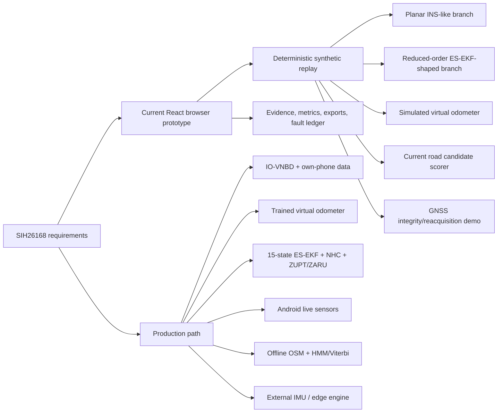
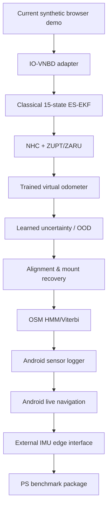

> **Project:** AstraNav-IDR / SIH26168  
> **Team:** Recalibrate  
> **Prototype repository:** `Stakeylock/sih26`  
> **Repository audit basis:** `main` at commit `bced51a6e710a1a9c3bdf8df9271f5b7d7253b97`  
> **Problem statement:** SIH26168 — *AI-ML based Intelligent Dead Reckoning system for seamless navigation*, ISRO / Department of Space  
> **Status convention:** **Implemented** = present in current repository; **Simulated** = represented by deterministic prototype logic; **Target** = production architecture required to satisfy the PS; **Planned** = not yet implemented.

> The current repository is intentionally a transparent, deterministic browser prototype. It must not be represented as a validated real-world navigation engine until IO-VNBD, Android, trained-model, full-filter and runtime validation milestones are completed.

# 1. Project Charter and Problem-Statement Traceability

## 1.1 Purpose

AstraNav-IDR is intended to transform a **standalone smartphone** into an intelligent vehicle dead-reckoning system that continues navigation during GNSS degradation or blackout and returns safely to GNSS-aided navigation when satellite fixes become reliable again.

The project is not an end-to-end neural coordinate regressor. Its north-star design principle is:

> **AI estimates useful virtual measurements, corrections, context and uncertainty; physics and probabilistic estimation maintain the navigation state.**

The final deliverable must support both a **mobile application** using built-in phone sensors and an **edge-deployable navigation engine** that can accept an external IMU front-end.

## 1.2 Problem-statement requirements

| ID | Requirement from PS | Acceptance interpretation |
|---|---|---|
| PS-R01 | Standalone smartphone navigation | No runtime dependency on OBD-II, wheel encoder or CAN speed |
| PS-R02 | Phone IMU inputs | Accelerometer + gyroscope; magnetometer/compass also available |
| PS-R03 | GNSS inputs when available | GPS/Galileo/NavIC-class GNSS data accepted opportunistically |
| PS-R04 | In-vehicle alignment and calibration | Determine phone pitch, roll and yaw relative to vehicle direction |
| PS-R05 | AI speed and vibration filter | Estimate forward speed and reject/discount road vibration, potholes and bumps |
| PS-R06 | Dead reckoning during GNSS outage | Immediate inertial continuity without a frozen map |
| PS-R07 | GNSS+INS fusion | Fuse GNSS and IMU with AI/ML assistance to reduce drift |
| PS-R08 | Advanced map matching | Use offline road geometry as a navigation constraint |
| PS-R09 | Kinematic constraints | NHC or equivalent vehicle-motion constraints |
| PS-R10 | Seamless deficit handler | Fast transition into DR and controlled transition back to GNSS |
| PS-R11 | Real-time mobile UI | Smooth uninterrupted vehicle display |
| PS-R12 | IO-VNBD | Train/test on IO-VNBD; proposal screening requires preliminary model evidence |
| PS-R13 | Position plot from IO-VNBD subset | Produce an inferred-position plot from a subset |
| PS-R14 | On-device execution | Train apriori on desktop/cloud; run lightweight inference locally |
| PS-R15 | External IMU portability | Algorithms/models must not be limited to phone IMU |
| PS-R16 | Smartphone output rate | Approx. 10 Hz navigation output |
| PS-R17 | External high-rate path | Around 200 Hz in the stated FOG/external-IMU context |
| PS-R18 | Drift benchmark | <10% position drift relative to distance travelled during blackout |
| PS-R19 | Example short benchmark | Desired <5 m over 50 m in <1 min |
| PS-R20 | Example long benchmark | Desired <100 m over 1 km GNSS-denied travel at ~60 km/h |

## 1.3 Current prototype traceability

### Existing strengths

- deterministic 120-second replay at 10 Hz;
- hidden-truth separation from estimator observations;
- independent INS, fused, map-assisted and classical-comparator outputs;
- GNSS degradation, denial, rejection and guarded reacquisition;
- causal fault injection for GNSS jumps, shocks, mount shifts and learned-speed anomalies;
- replay timeline, event ledger, metrics, evidence view and export;
- explicit synthetic-status warnings;
- regression tests for blackout, rejected fixes, map ambiguity and fault recovery.

These are excellent **research-instrument scaffolding**.

## 1.4 Critical gaps versus the actual PS

| Gap | Current prototype | PS-aligned target | Priority |
|---|---|---|---|
| Real dataset | Synthetic route only | IO-VNBD replay + plots | **P0** |
| AI model | Ground-truth-derived synthetic speed + noise | Trained model from real IMU windows | **P0** |
| INS | 2-D planar speed/yaw integration | 3-D strapdown mechanization | **P0** |
| Filter | Position/speed/yaw + scalar variance | 15-state ES-EKF with full covariance | **P0** |
| Bias estimation | Injected behavior only | Explicit accel/gyro bias states + calibration | **P0** |
| NHC | Not implemented as a real filter update | Lateral/vertical velocity update | **P0** |
| ZUPT/ZARU | Not implemented | Stationary-gated updates | **P0** |
| Self-calibration | Mount fault flag only | Roll/pitch/yaw alignment engine | **P0** |
| Map matching | Per-frame geometric score | Temporal HMM/Viterbi on connected OSM graph | **P0** |
| Map feedback | Separate output only | Confidence-gated road heading/position update | P1 |
| Android | Browser UI | Kotlin/Android live sensors + native core | **P0** |
| On-device AI | Simulated | ONNX Runtime/LiteRT measured inference | **P0** |
| External IMU | Concept only | Common data contract + high-rate test | P1 |
| Uncertainty | Illustrative heuristic bound | Calibrated covariance + NIS/coverage | P1 |
| GNSS quality | Residual-only synthetic gate | Receiver metadata + NIS + consistency | P1 |
| Real performance | Synthetic only | Held-out benchmark <10% target | **P0** |

## 1.5 System success definition

AstraNav-IDR should be considered **PS-ready** only when:

1. IO-VNBD can be loaded through the replay contract.
2. A trained virtual-odometer model produces speed and uncertainty from IMU windows.
3. A real 15-state ES-EKF runs on those measurements.
4. NHC and stationary updates are implemented and tested.
5. Artificial GNSS blackouts are evaluated without hidden GNSS entering the estimator.
6. Drift percentage uses hidden reference only.
7. A trip-disjoint held-out evaluation is reported.
8. At least one own-phone Android drive is replayed.
9. Android live inference sustains ~10 Hz navigation output.
10. UI clearly distinguishes synthetic, benchmark-replay and live modes.

## 1.6 Milestone ladder

## 1.7 Source basis

- Prototype: `Stakeylock/sih26`, commit `bced51a6...`.
- SIH26168 problem statement mirror: `vedantchalke36/sih-2026-problem-statements/ps_2026/SIH26168.md`.
- Required dataset: IO-VNBD — *Inertial and Odometry Benchmark Dataset for Ground Vehicle Positioning*.
