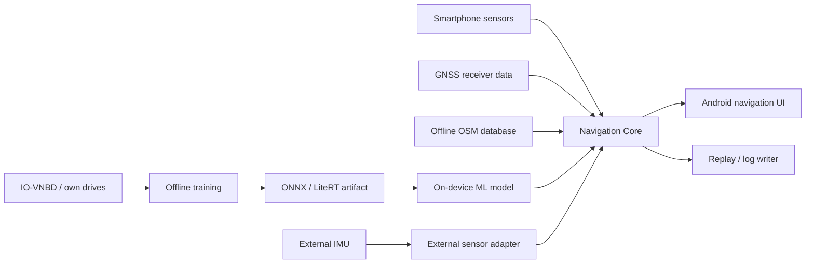
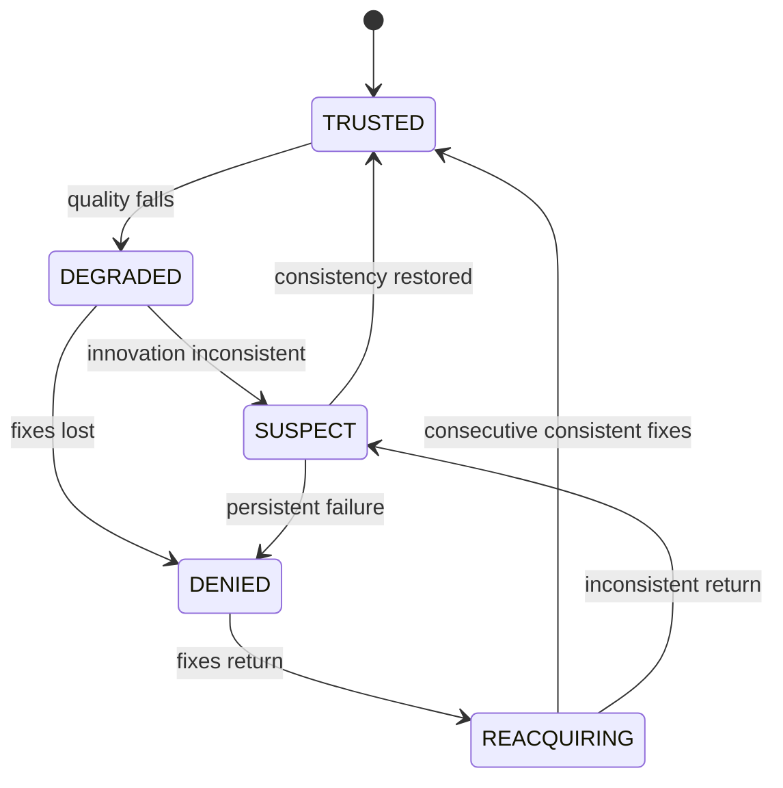
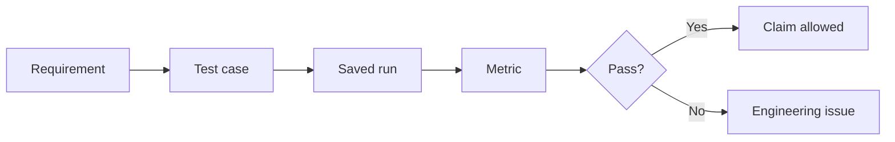

> **Project:** AstraNav-IDR / SIH26168  
> **Team:** Recalibrate  
> **Prototype repository:** `Stakeylock/sih26`  
> **Repository audit basis:** `main` at commit `bced51a6e710a1a9c3bdf8df9271f5b7d7253b97`  
> **Problem statement:** SIH26168 — *AI-ML based Intelligent Dead Reckoning system for seamless navigation*, ISRO / Department of Space  
> **Status convention:** **Implemented** = present in current repository; **Simulated** = represented by deterministic prototype logic; **Target** = production architecture required to satisfy the PS; **Planned** = not yet implemented.

> The current repository is intentionally a transparent, deterministic browser prototype. It must not be represented as a validated real-world navigation engine until IO-VNBD, Android, trained-model, full-filter and runtime validation milestones are completed.

# 2. Software and System Requirements Specification (SRS)

## 2.1 System context

## 2.2 Functional requirements

### FR-001 Sensor acquisition
Acquire accelerometer, gyroscope, magnetometer, GNSS position/speed and available GNSS quality metadata.

### FR-002 Timestamp normalization
Normalize asynchronous sources onto a monotonic navigation clock; flag duplicate, stale and out-of-order packets.

### FR-003 Unit normalization
Use SI units throughout the engine: m/s², rad/s, m/s, meters or explicitly tagged WGS-84 coordinates.

### FR-004 Coordinate-frame contract
Support phone/device frame, vehicle frame, ENU/NED navigation frame and WGS-84 interface.

### FR-005 Initial calibration
Estimate initial gyro bias and acceleration/gravity consistency from a stationary window.

### FR-006 Phone-to-vehicle alignment
Estimate phone pitch, roll and yaw relative to vehicle direction.

### FR-007 Mount-change detection
Detect material alignment changes and weaken frame-sensitive constraints until recovery.

### FR-008 Strapdown mechanization
Propagate quaternion attitude, velocity and position.

### FR-009 ES-EKF
Estimate:
\[
\delta x=[\delta p,\delta v,\delta\theta,\delta b_a,\delta b_g]^T.
\]

### FR-010 NHC
Apply lateral/vertical velocity pseudo-measurements when valid for the current vehicle context.

### FR-011 Stationary detector
Distinguish true stationary state from engine-idle vibration.

### FR-012 ZUPT/ZARU
Apply stationary corrections only when confidence passes the gate.

### FR-013 Virtual odometer
Estimate forward speed from a causal IMU window.

### FR-014 Model uncertainty
Output predicted variance or a calibrated confidence convertible to covariance.

### FR-015 OOD guard
Suppress/down-weight learned measurements when OOD or physically inconsistent.

### FR-016 GNSS integrity state machine

### FR-017 GNSS update
Fuse GNSS only after quality and innovation gates pass.

### FR-018 Controlled reacquisition
The first post-blackout fix shall not directly snap the state.

### FR-019 Offline road graph
Navigation shall operate with offline road data.

### FR-020 HMM/Viterbi map matching
Use temporal road hypotheses, not current nearest-road projection alone.

### FR-021 Safe map feedback
Apply road-derived correction only when posterior, margin and innovation gates pass.

### FR-022 10 Hz mobile publication
Publish final phone navigation solution at approximately 10 Hz or better.

### FR-023 External IMU mode
Support higher-rate external IMU packets without changing estimator semantics.

### FR-024 Replay modes
Support synthetic, IO-VNBD, own-phone and external-IMU replay.

### FR-025 Provenance
Record dataset/source, commit, model hash, filter config, map version and device metadata.

## 2.3 Non-functional requirements

| ID | Requirement | Target |
|---|---|---|
| NFR-01 | Offline operation | No cloud required during navigation |
| NFR-02 | Replay determinism | Same source/config → same result |
| NFR-03 | Mobile update | ~10 Hz |
| NFR-04 | Edge scalability | 100–200 Hz-capable architecture |
| NFR-05 | Fault containment | Bad GNSS/ML/map cannot silently dominate |
| NFR-06 | Explainability | Expose mode, trust and health |
| NFR-07 | Testability | Measurement updates individually disable-able |
| NFR-08 | Reproducibility | Config/model/commit recorded |
| NFR-09 | Causality | No future samples |
| NFR-10 | Privacy | Local processing by default |
| NFR-11 | Portability | Same core API for phone/external IMU |

## 2.4 Performance requirements

\[
\text{Drift \%}=100\frac{\|p_{\text{est}}-p_{\text{ref}}\|}{\text{distance travelled during blackout}}.
\]

Target:
\[
\text{Drift}<10\%.
\]

Also measure sensor-to-solution latency p50/p95/p99, inference latency, filter latency, map latency, UI publication rate, dropped packets, RAM and thermal/battery impact.

## 2.5 Safety/integrity invariants

1. Quaternion remains normalized.
2. Covariance remains finite and numerically valid.
3. Rejected GNSS produces zero correction.
4. Invalid ML output is never fused.
5. Low-confidence map output never feeds back.
6. Future samples never affect current replay.
7. Unit/frame metadata is mandatory.
8. Missing GNSS is explicit, never a zero position.
9. Simulated confidence is never presented as calibrated confidence.
10. Every public claim maps to a saved experiment.

## 2.6 Claim gate

