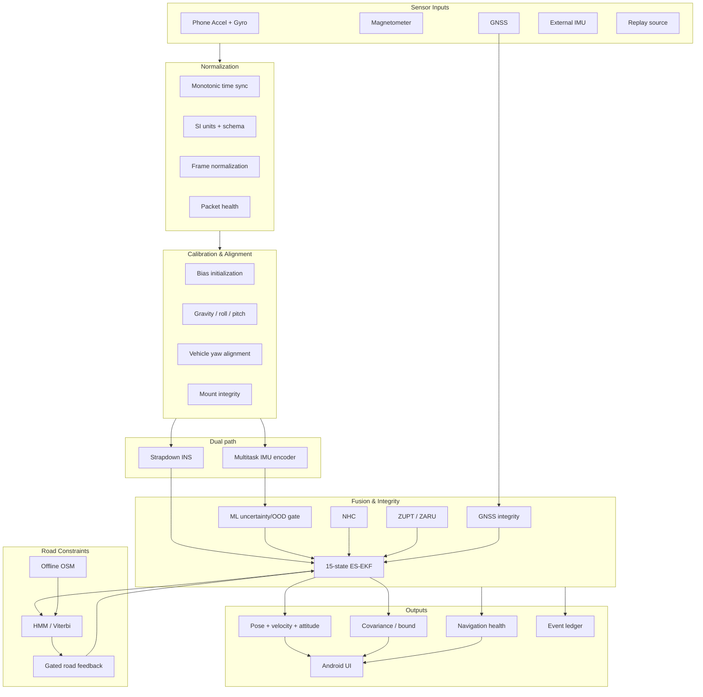
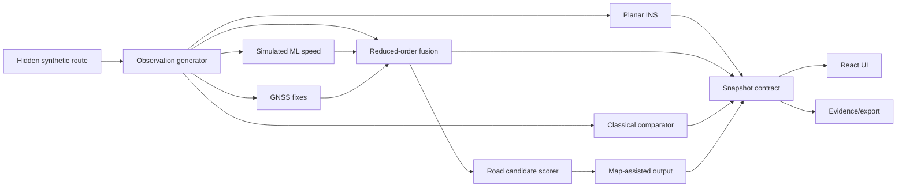
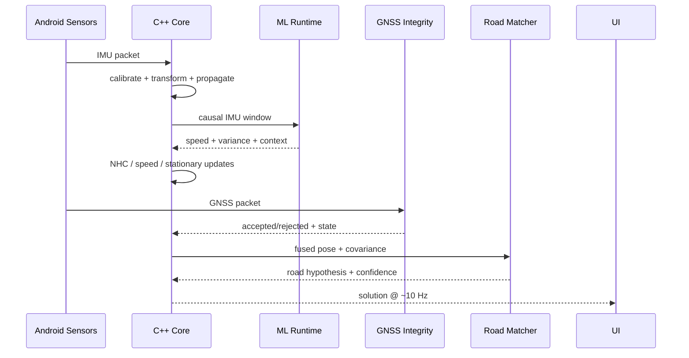
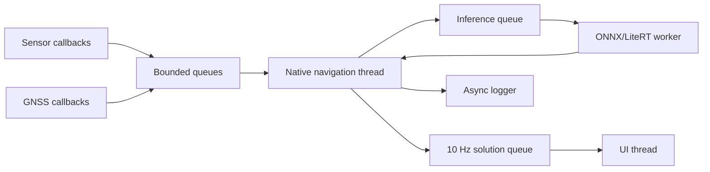

> **Project:** AstraNav-IDR / SIH26168  
> **Team:** Recalibrate  
> **Prototype repository:** `Stakeylock/sih26`  
> **Repository audit basis:** `main` at commit `bced51a6e710a1a9c3bdf8df9271f5b7d7253b97`  
> **Problem statement:** SIH26168 — *AI-ML based Intelligent Dead Reckoning system for seamless navigation*, ISRO / Department of Space  
> **Status convention:** **Implemented** = present in current repository; **Simulated** = represented by deterministic prototype logic; **Target** = production architecture required to satisfy the PS; **Planned** = not yet implemented.

> The current repository is intentionally a transparent, deterministic browser prototype. It must not be represented as a validated real-world navigation engine until IO-VNBD, Android, trained-model, full-filter and runtime validation milestones are completed.


# 3. System Architecture and Interfaces

## 3.1 Target architecture



## 3.2 Current prototype architecture

Current `simulation.ts` implements a deterministic TypeScript test double with synthetic observations, planar `{position,speed,yaw,variance}` state, pure INS, reduced-order fused branch, classical comparator, simulated learned speed, GNSS residual gate and per-frame road scoring.



## 3.3 Recommended repository split

```text
astranav/
├── apps/
│   ├── android/
│   └── web-replay/
├── core/
│   ├── include/astranav/
│   ├── src/
│   │   ├── frames/
│   │   ├── mechanization/
│   │   ├── eskf/
│   │   ├── constraints/
│   │   ├── integrity/
│   │   ├── map/
│   │   └── replay/
│   └── tests/
├── ml/
│   ├── data/
│   ├── models/
│   ├── training/
│   ├── export/
│   └── evaluation/
├── adapters/
│   ├── io_vnbd/
│   ├── android_log/
│   ├── external_imu/
│   └── synthetic/
├── maps/
├── experiments/
├── configs/
└── docs/
```

## 3.4 Canonical contracts

```cpp
struct ImuPacket {
    int64_t t_monotonic_ns;
    Vec3 accel_mps2;
    Vec3 gyro_radps;
    optional<Vec3> mag_uT;
    FrameId frame;
    uint32_t status_flags;
};
```

```cpp
struct LearnedMeasurement {
    int64_t t_ns;
    double forward_speed_mps;
    double speed_variance;
    double stationary_probability;
    double rough_probability;
    double mount_shift_probability;
    double ood_score;
};
```

```cpp
struct NavigationSolution {
    int64_t t_ns;
    Vec3 position_enu_m;
    Vec3 velocity_enu_mps;
    Quaternion q_vehicle_to_nav;
    Vec3 accel_bias;
    Vec3 gyro_bias;
    Matrix15 covariance;
    GnssIntegrityState gnss_state;
    NavigationHealth health;
};
```

## 3.5 Live sequence



## 3.6 Threading



Rules: no model inference on UI thread, no disk I/O in sensor callbacks, bounded queues, explicit dropped-packet telemetry, deterministic replay.

## 3.7 Browser integration path

Preserve the existing `Snapshot` UI boundary:

```text
NavigationSolution (C++)
        ↓ JNI / serializer
Replay/Android adapter
        ↓
Existing visualization semantics
```

The web UI should evolve into a real benchmark/replay console rather than being replaced.
