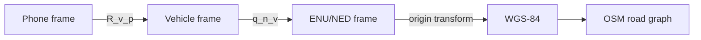
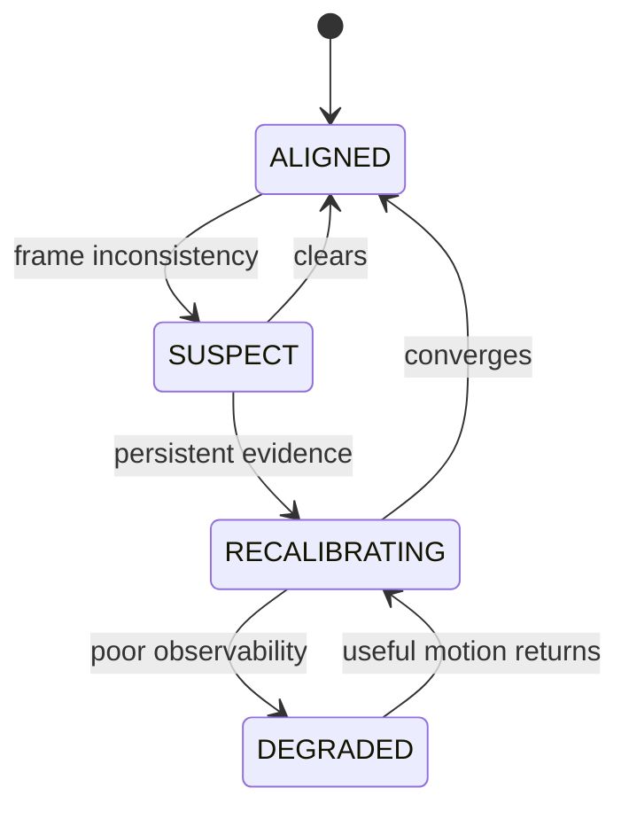

> **Project:** AstraNav-IDR / SIH26168  
> **Team:** Recalibrate  
> **Prototype repository:** `Stakeylock/sih26`  
> **Repository audit basis:** `main` at commit `bced51a6e710a1a9c3bdf8df9271f5b7d7253b97`  
> **Problem statement:** SIH26168 — *AI-ML based Intelligent Dead Reckoning system for seamless navigation*, ISRO / Department of Space  
> **Status convention:** **Implemented** = present in current repository; **Simulated** = represented by deterministic prototype logic; **Target** = production architecture required to satisfy the PS; **Planned** = not yet implemented.

> The current repository is intentionally a transparent, deterministic browser prototype. It must not be represented as a validated real-world navigation engine until IO-VNBD, Android, trained-model, full-filter and runtime validation milestones are completed.


# 4. Sensor Physics, Calibration and Coordinate Frames

## 4.1 Error sources

Consumer phone MEMS sensors have additive bias, drift, white noise, scale error, cross-axis error, temperature dependence, vibration, timing jitter and arbitrary mounting.

A practical model is:

\[
a_m=S_aRa_{\text{true}}+b_a+n_a
\]

\[
\omega_m=S_g\omega_{\text{true}}+b_g+n_g.
\]

## 4.2 Error growth

\[
e_v(t)\approx b_a t,\qquad e_p(t)\approx\frac12b_a t^2
\]

\[
\delta\psi(t)\approx b_g t
\]

\[
e_\perp\approx s\sin(\delta\psi).
\]

This is why heading calibration is as important as speed estimation.

## 4.3 Coordinate frames



Never assume the phone X-axis is vehicle forward.

## 4.4 Startup calibration

### Stationary detection
Require low gyro norm, acceleration magnitude near gravity and vehicle-aware vibration checks.

### Gyro bias
\[
\hat b_g=\frac1N\sum_{k=1}^N\omega_{m,k}.
\]

### Gravity direction
\[
\hat g_p=\frac{\bar a}{\|\bar a\|}.
\]
This gives roll/pitch information.

### Forward-axis/yaw alignment
Use dominant gravity-removed acceleration, PCA, trusted GNSS course and optionally road bearing.

### Phone-to-vehicle transform
\[
a^v=R_p^v(a^p-\hat b_a)
\]
\[
\omega^v=R_p^v(\omega^p-\hat b_g).
\]

## 4.5 PCA intuition

\[
C=\frac1N\sum_i(a_i-\bar a)(a_i-\bar a)^T.
\]

Principal eigenvector approximates dominant longitudinal motion. Resolve sign using GNSS course or acceleration/braking semantics.

## 4.6 Mount-shift state machine



While uncertain:
- inflate ML covariance;
- weaken NHC;
- suspend road-heading feedback if needed;
- continue inertial propagation with larger uncertainty.

## 4.7 Magnetometer

Treat magnetometer as optional aid only. Vehicle interiors create hard/soft-iron disturbance. Gate on field magnitude, stability and innovation consistency.

## 4.8 Temperature

At minimum, log temperature where available and let bias states vary slowly. Advanced work can model \(b(T)\) per device.

## 4.9 Acceptance tests

1. corrected stationary gyro mean near zero;
2. gravity magnitude plausible;
3. roll/pitch stable;
4. forward axis agrees with trusted GNSS course;
5. random phone rotations recover;
6. mount shift detected;
7. NHC softens during poor alignment;
8. calibration confidence is logged.

## 4.10 Current prototype gap

The repository currently models mount shift as a timed fault and alignment scalar. It does **not** estimate \(R_p^v\), bias, gravity orientation or scale from actual samples.

Target replacement:

```text
actual IMU window
→ stationary/motion classification
→ bias estimate
→ gravity leveling
→ yaw alignment
→ confidence/covariance
→ frame transform
```
