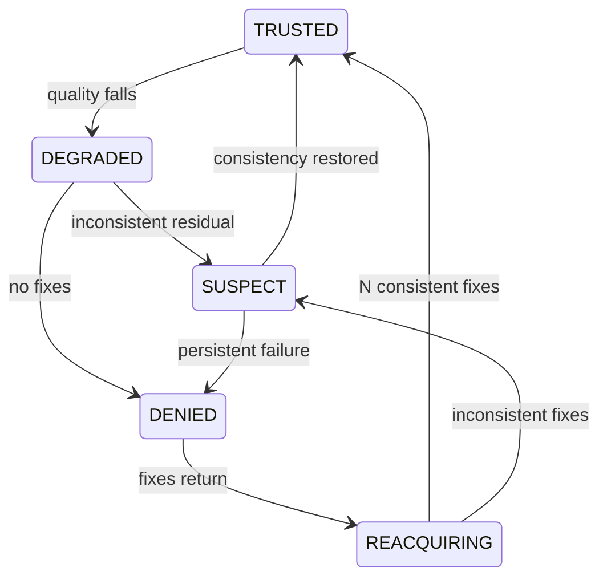
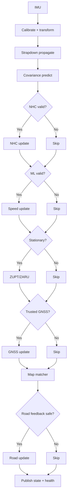

> **Project:** AstraNav-IDR / SIH26168  
> **Team:** Recalibrate  
> **Prototype repository:** `Stakeylock/sih26`  
> **Repository audit basis:** `main` at commit `bced51a6e710a1a9c3bdf8df9271f5b7d7253b97`  
> **Problem statement:** SIH26168 — *AI-ML based Intelligent Dead Reckoning system for seamless navigation*, ISRO / Department of Space  
> **Status convention:** **Implemented** = present in current repository; **Simulated** = represented by deterministic prototype logic; **Target** = production architecture required to satisfy the PS; **Planned** = not yet implemented.

> The current repository is intentionally a transparent, deterministic browser prototype. It must not be represented as a validated real-world navigation engine until IO-VNBD, Android, trained-model, full-filter and runtime validation milestones are completed.

# 5. Navigation Core: Strapdown INS, ES-EKF, Integrity and Constraints

## 5.1 Nominal and error states

\[
x=[p^n,v^n,q_b^n,b_a,b_g]
\]

\[
\delta x=[\delta p,\delta v,\delta\theta,\delta b_a,\delta b_g]^T\in\mathbb{R}^{15}.
\]

## 5.2 Strapdown mechanization

\[
\tilde f_b=f_m-b_a,\qquad
\tilde\omega_b=\omega_m-b_g
\]

\[
\dot q_b^n=\frac12q_b^n\otimes\Omega(\tilde\omega_b)
\]

\[
\dot v^n=R_b^n(q)\tilde f_b+g^n
\]

\[
\dot p^n=v^n.
\]

## 5.3 ES-EKF prediction

\[
\dot{\delta x}=F\delta x+Gw
\]

\[
P_k^-=\Phi_kP_{k-1}^+\Phi_k^T+Q_k.
\]

## 5.4 Generic update

\[
r=z-h(x)
\]

\[
S=HPH^T+R
\]

\[
K=PH^TS^{-1}
\]

\[
\delta x=Kr.
\]

Inject correction into nominal state, then reset error state consistently.

## 5.5 NHC

For a normal car:

\[
v_y^v\approx0,\qquad v_z^v\approx0.
\]

Weaken during skid, aggressive motion, rough road, poor alignment and two-wheeler banking.

## 5.6 Learned speed

\[
z_v=\hat v_x^v-v_x^v,\qquad R_v=\sigma_v^2.
\]

This is the primary safe interface from ML to filter.

## 5.7 ZUPT/ZARU

\[
z_{\text{ZUPT}}=0-v
\]

\[
z_{\text{ZARU}}=0-\omega.
\]

Use only under a vehicle-aware stationary gate.

## 5.8 GNSS measurement

\[
z_{\text{GNSS}}=
\begin{bmatrix}p_{\text{GNSS}}\\v_{\text{GNSS}}\end{bmatrix}
-
\begin{bmatrix}p\\v\end{bmatrix}.
\]

Covariance should reflect receiver quality and integrity state.

## 5.9 NIS gating

\[
\text{NIS}=r^TS^{-1}r.
\]

Large NIS indicates inconsistency between measurement and predicted uncertainty.

## 5.10 GNSS integrity

Current prototype already demonstrates a three-consistent-fix reacquisition idea; preserve it.

## 5.11 Road heading

\[
z_\psi=\operatorname{wrap}(\psi_{\text{road}}-\psi_{\text{est}})
\]

with confidence-based covariance and innovation cap.

## 5.12 Full production cycle

## 5.13 Current prototype deficiencies

Current `simulation.ts` has:
- 2-D position/speed/yaw + scalar variance only;
- no quaternion;
- no accel/gyro bias state;
- no 15×15 covariance;
- no explicit NHC update;
- no ZUPT/ZARU;
- scalarized position GNSS correction;
- fixed proportional ML-speed blend;
- heuristic process noise;
- no map feedback into the fused state.

These are acceptable demo simplifications but should be the highest-priority navigation-core replacements.

## 5.14 Core unit tests

- quaternion norm;
- constant acceleration;
- constant turn;
- stationary bias convergence;
- covariance symmetry/PSD;
- NHC residual;
- ZUPT/ZARU gating;
- rejected GNSS zero correction;
- reacquisition;
- learned covariance effect;
- map-heading gate;
- deterministic replay.
