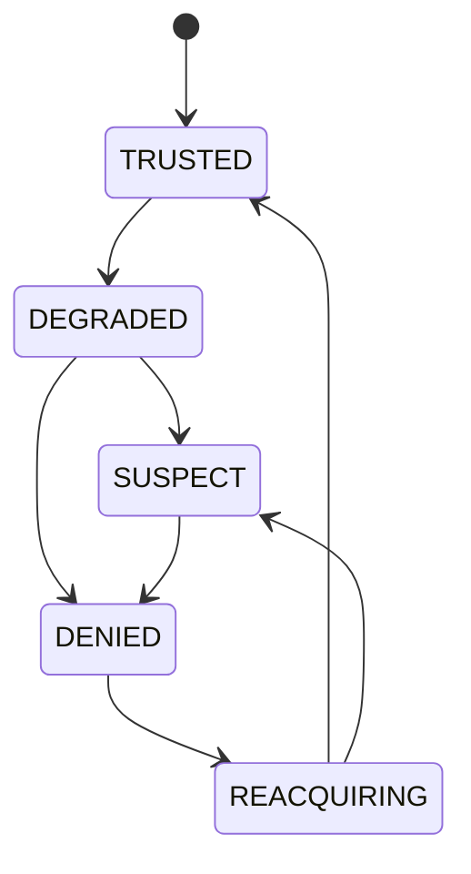
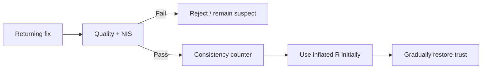
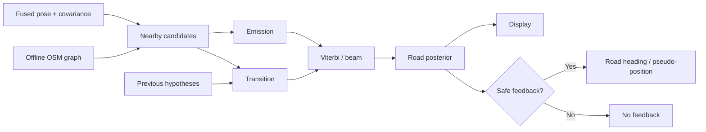

> **Project:** AstraNav-IDR / SIH26168  
> **Team:** Recalibrate  
> **Prototype repository:** `Stakeylock/sih26`  
> **Repository audit basis:** `main` at commit `bced51a6e710a1a9c3bdf8df9271f5b7d7253b97`  
> **Problem statement:** SIH26168 — *AI-ML based Intelligent Dead Reckoning system for seamless navigation*, ISRO / Department of Space  
> **Status convention:** **Implemented** = present in current repository; **Simulated** = represented by deterministic prototype logic; **Target** = production architecture required to satisfy the PS; **Planned** = not yet implemented.

> The current repository is intentionally a transparent, deterministic browser prototype. It must not be represented as a validated real-world navigation engine until IO-VNBD, Android, trained-model, full-filter and runtime validation milestones are completed.


# 7. GNSS Integrity, Map Matching and Reacquisition

## 7.1 GNSS is not binary

Typical sequence:

```text
good sky
→ degraded geometry / multipath
→ biased or jumpy fixes
→ outage
→ unstable return
→ stable recovery
```



## 7.2 Integrity inputs

Use as available:

- horizontal/vertical accuracy;
- speed accuracy;
- satellite count;
- CN0;
- fix age;
- GNSS course;
- clock indicators;
- position NIS;
- inertial speed residual;
- heading residual;
- map consistency.

## 7.3 Pre-outage protection

A critical failure mode is bad GNSS contaminating the filter before full blackout.

Actions:

- increase GNSS covariance as quality falls;
- reject large innovations;
- preserve inertial continuity;
- avoid using suspect GNSS for calibration refresh.

## 7.4 Controlled reacquisition



Never hard snap to the first returning fix.

## 7.5 Current prototype strengths

The synthetic engine already:

- removes fixes during blackout;
- uses `REACQUIRING`;
- applies an innovation magnitude gate;
- requires three consistent returning fixes;
- applies zero correction on rejected GNSS.

Preserve these semantics.

## 7.6 Current prototype limitation

Current GNSS integrity is dominated by Euclidean residual thresholding.

Production gating should use statistical residuals and receiver metadata.

## 7.7 Why true HMM/Viterbi is needed

Current browser prototype uses current-frame road candidate scoring. That is **not** full temporal HMM/Viterbi.

True map matching:

- hidden state \(s_t\): road segment;
- observation \(o_t\): fused pose;
- emission \(P(o_t|s_t)\): pose compatibility;
- transition \(P(s_t|s_{t-1})\): topological and kinematic plausibility.

Viterbi recurrence:

\[
\delta_t(j)=
\max_i[\delta_{t-1}(i)a_{ij}]b_j(o_t).
\]

## 7.8 HMM architecture



## 7.9 Emission model

\[
\log P(o_t|s)
\propto
-\frac{d_\perp^2}{2\sigma_d^2}
-\frac{\Delta\psi^2}{2\sigma_\psi^2}.
\]

## 7.10 Transition model

Use:

- graph connectivity;
- network path distance vs travelled distance;
- heading continuity;
- impossible-turn penalty;
- one-way restrictions where map data supports it.

## 7.11 Safe road feedback

\[
z_\psi=\operatorname{wrap}(\psi_{\text{road}}-\psi_{\text{est}})
\]

with:

\[
P_{\text{match}}>\tau_p,
\qquad
P_1-P_2>\tau_m,
\qquad
|z_\psi|<\psi_{\max}.
\]

## 7.12 Flyover example

Nearest-road can choose the road physically closest in 2-D even when it is an impossible transition. HMM/Viterbi chooses the most plausible **sequence**.

## 7.13 Offline map package

Recommended:

- clipped OSM region;
- connected road graph;
- segment geometry;
- one-way attributes;
- spatial index.

Do not rely on live cloud map APIs for core navigation.

## 7.14 Acceptance tests

1. parallel roads;
2. flyover/underpass;
3. ambiguous fork;
4. U-turn;
5. tunnel exit;
6. wrong GNSS fix near adjacent road;
7. missing map segment;
8. low posterior pauses feedback;
9. bad map match cannot create unbounded heading correction.
