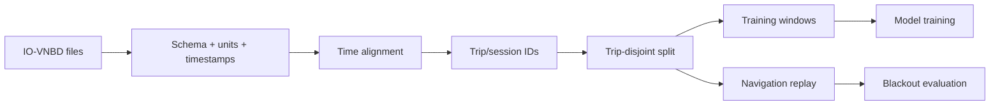

> **Project:** AstraNav-IDR / SIH26168  
> **Team:** Recalibrate  
> **Prototype repository:** `Stakeylock/sih26`  
> **Repository audit basis:** `main` at commit `bced51a6e710a1a9c3bdf8df9271f5b7d7253b97`  
> **Problem statement:** SIH26168 — *AI-ML based Intelligent Dead Reckoning system for seamless navigation*, ISRO / Department of Space  
> **Status convention:** **Implemented** = present in current repository; **Simulated** = represented by deterministic prototype logic; **Target** = production architecture required to satisfy the PS; **Planned** = not yet implemented.

> The current repository is intentionally a transparent, deterministic browser prototype. It must not be represented as a validated real-world navigation engine until IO-VNBD, Android, trained-model, full-filter and runtime validation milestones are completed.


# 8. Datasets, Training, Experiments and Evaluation

## 8.1 Dataset hierarchy

### Tier 0 — mandatory
**IO-VNBD**

Use it for schema audit, virtual-odometer training, screening subset inference, blackout replay and ablations.

### Tier 1 — own smartphone data

Collect multiple phones, mounts and road conditions including smooth road, rough road, potholes, stop-go traffic and deliberate mount shifts.

### Tier 2 — external/high-rate
Use only after smartphone baseline is stable.

## 8.2 IO-VNBD ingestion



## 8.3 Session manifest

```yaml
session_id:
source:
device:
vehicle:
driver_id:
country:
start_time:
imu_rate_hz:
gnss_rate_hz:
frame_convention:
units:
reference_speed_source:
reference_position_source:
known_faults:
notes:
```

## 8.4 Split policy

Never:
```text
random overlapping windows → train/test
```

Always:
```text
complete trips → split → windows
```

## 8.5 Artificial blackouts

Time grid:

- 10 s;
- 30 s;
- 60 s;
- 120 s where possible.

Distance grid:

- 50 m;
- 100 m;
- 250 m;
- 500 m;
- 1 km.

Context:

- straight;
- turn-heavy;
- rough;
- stop-go;
- highway;
- urban.

## 8.6 Baseline ladder

| ID | Configuration |
|---|---|
| B0 | Raw/simple inertial integration |
| B1 | Strapdown INS |
| B2 | ES-EKF with bias states |
| B3 | + NHC |
| B4 | + ZUPT/ZARU |
| B5 | + learned virtual speed |
| B6 | + learned uncertainty |
| B7 | + alignment/mount handling |
| B8 | + GNSS integrity |
| B9 | + HMM map matching |
| B10 | + gated road feedback |

## 8.7 Core metrics

\[
FPE=\|p_T-\hat p_T\|
\]

\[
D=100\frac{FPE}{s_{\text{blackout}}}
\]

\[
RMSE=
\sqrt{\frac1N\sum_{k=1}^N\|p_k-\hat p_k\|^2}.
\]

Also measure:

- speed MAE/RMSE;
- heading circular MAE;
- cross-track and along-track error;
- p50/p95/p99 error;
- reacquisition jump and settling;
- uncertainty coverage;
- NIS consistency;
- map-segment accuracy where possible;
- inference/filter/map latency;
- RAM and update rate.

## 8.8 PS screening package

The PS explicitly asks for preliminary AI model evidence and a position plot on an IO-VNBD subset.

Minimum package:

1. exact session/trip;
2. held-out interval;
3. blackout start/end;
4. reference trajectory;
5. inertial baseline;
6. AI-aided result;
7. final position error;
8. drift percentage;
9. model definition;
10. split statement.

Recommended plot layers:

```text
Reference
GNSS before/after blackout
Classical INS/ES-EKF
AI-aided ES-EKF
Blackout start/end
Final error annotation
```

## 8.9 Uncertainty evaluation

\[
\text{coverage}=
\frac{\#\{e_k\le r_{95,k}\}}{N}.
\]

A “95% bound” should empirically cover approximately 95% of held-out error samples while remaining reasonably sharp.

## 8.10 Reuse current prototype strengths

Current app already has deterministic runs, observed-only metrics, no future leakage, JSON/CSV export, separate estimator traces and fault injection.

Make `simulate(config)` just one replay source alongside:

```text
IoVnbdReplaySource
AndroidLogReplaySource
ExternalImuReplaySource
```

This allows real experiments to use the existing evidence UI.
