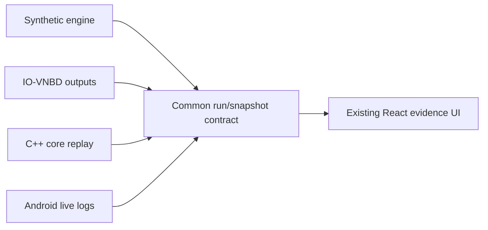
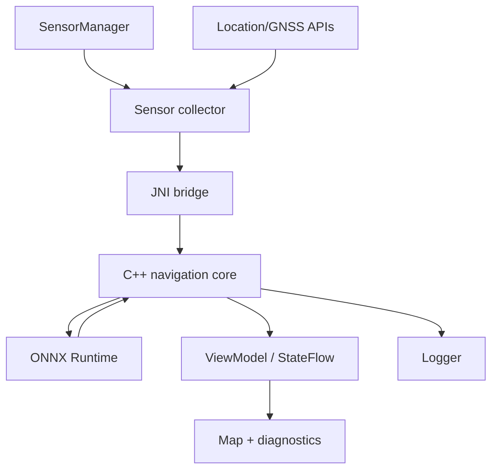
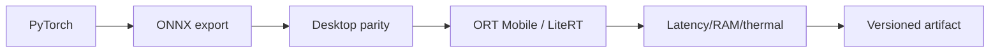

> **Project:** AstraNav-IDR / SIH26168  
> **Team:** Recalibrate  
> **Prototype repository:** `Stakeylock/sih26`  
> **Repository audit basis:** `main` at commit `bced51a6e710a1a9c3bdf8df9271f5b7d7253b97`  
> **Problem statement:** SIH26168 — *AI-ML based Intelligent Dead Reckoning system for seamless navigation*, ISRO / Department of Space  
> **Status convention:** **Implemented** = present in current repository; **Simulated** = represented by deterministic prototype logic; **Target** = production architecture required to satisfy the PS; **Planned** = not yet implemented.

> The current repository is intentionally a transparent, deterministic browser prototype. It must not be represented as a validated real-world navigation engine until IO-VNBD, Android, trained-model, full-filter and runtime validation milestones are completed.


# 9. Prototype Implementation, Android, Edge Deployment and Replay

## 9.1 Current repository audit

Technology:

- React 19;
- TypeScript;
- Vite;
- Vitest;
- deterministic synthetic engine;
- no backend.

| Module | Current role |
|---|---|
| `engine/simulation.ts` | synthetic sensors, planar propagation, GNSS gate, ML-speed test double, candidate roads, metrics |
| `engine/types.ts` | run/snapshot/event contracts |
| `engine/scenarios.ts` | synthetic scenarios |
| `hooks/useReplay.ts` | replay clock, seek, faults |
| `CityMap.tsx` | trajectory layers |
| `Telemetry.tsx` | trust, speed, heading, ML quality |
| `ReplayLab.tsx` | fault injection + ledger |
| `Evidence.tsx` | metrics/export |
| `SystemView.tsx` | architecture explanation |

## 9.2 Keep the browser prototype

Use it as:

- judge-facing replay;
- diagnostic tool;
- benchmark visualizer;
- fault-injection lab;
- regression dashboard.



## 9.3 Source abstraction

```ts
interface NavigationReplaySource {
  metadata(): SourceMetadata;
  duration(): number;
  sampleAt(t: number): NavigationSnapshot;
  eventsUntil(t: number): NavigationEvent[];
}
```

Implement synthetic, IO-VNBD, native-core and Android-log sources.

## 9.4 Android architecture



### Kotlin owns
permissions, lifecycle, sensors, GNSS, UI, logging and map rendering.

### C++ owns
frames, quaternions, calibration, mechanization, ES-EKF, constraints, integrity and replay semantics.

## 9.5 Why native C++ matters

```text
Android phone
       ┐
IO-VNBD replay
       ├→ same navigation core
External IMU
       ┘
```

The app becomes one client of a reusable engine.

## 9.6 Sensor rate vs output rate

Do not confuse them.

Example:

```text
IMU 100 Hz
→ filter propagation 100 Hz
→ ML inference 10–50 Hz
→ UI solution 10 Hz
```

Current browser runs everything at 10 Hz; production should use the phone's actual available IMU rate.

## 9.7 External IMU protocol

Minimum fields:

```text
timestamp
accel_xyz
gyro_xyz
optional_mag
temperature
sensor_status
```

Add packet-loss counters and unit/profile metadata.

Do not claim “200 Hz validated” until measured.

## 9.8 Model deployment



## 9.9 Live logging

Record:

- raw IMU;
- raw GNSS;
- timestamps;
- calibration/alignment;
- model outputs;
- filter updates;
- covariance summary;
- road hypotheses;
- integrity state;
- final solution;
- device/model/software metadata.

## 9.10 Build modes

```text
SYNTHETIC_DEMO
IOVNBD_REPLAY
ANDROID_REPLAY
ANDROID_LIVE
EXTERNAL_IMU_REPLAY
EXTERNAL_IMU_LIVE
```

Show current mode visibly in UI.

## 9.11 CI

Add:

- formatter/linter;
- TS build/tests;
- C++ unit/replay tests;
- ONNX contract test;
- IO-VNBD smoke test;
- Android tests.

## 9.12 Highest-value prototype improvements

UI:
- `SYNTHETIC / IO-VNBD / LIVE` badge;
- sensor rate + output rate;
- active filter-update sources;
- NIS/gates in Expert mode;
- actual calibration state;
- session/model ID in Evidence;
- load saved real run;
- experiment manifest export.

Engine:
- native 15-state core;
- actual ML model;
- IO-VNBD adapter;
- NHC/ZUPT/ZARU;
- HMM/Viterbi;
- real coordinate transforms.
