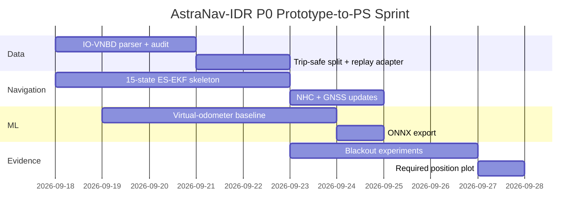

> **Project:** AstraNav-IDR / SIH26168  
> **Team:** Recalibrate  
> **Prototype repository:** `Stakeylock/sih26`  
> **Repository audit basis:** `main` at commit `bced51a6e710a1a9c3bdf8df9271f5b7d7253b97`  
> **Problem statement:** SIH26168 — *AI-ML based Intelligent Dead Reckoning system for seamless navigation*, ISRO / Department of Space  
> **Status convention:** **Implemented** = present in current repository; **Simulated** = represented by deterministic prototype logic; **Target** = production architecture required to satisfy the PS; **Planned** = not yet implemented.

> The current repository is intentionally a transparent, deterministic browser prototype. It must not be represented as a validated real-world navigation engine until IO-VNBD, Android, trained-model, full-filter and runtime validation milestones are completed.

# 10. Verification, Risk, Prototype Gap Audit and Development Roadmap

## 10.1 Executive assessment

The repository is a **strong judge-facing simulation and evidence instrument**, but currently closer to a **transparent replay lab** than the final PS deliverable.

Its strongest qualities are:

- deterministic replay;
- estimator separation;
- trust visualization;
- fault injection;
- event provenance;
- metrics/export;
- honest synthetic labeling.

The fastest route to PS compliance is **not a UI rewrite**. Replace the synthetic backend block-by-block while preserving the current evidence front-end.

## 10.2 Detailed gap matrix

| Area | Current | PS-aligned target | Priority |
|---|---|---|---|
| UI | browser demo | working mobile app | **P0** |
| Raw IMU | synthetic scalar accel/yaw | live 6-axis IMU | **P0** |
| IO-VNBD | pending | required benchmark | **P0** |
| ML speed | truth-derived synthetic | trained model | **P0** |
| ML confidence | heuristic | calibrated uncertainty | P1 |
| INS | planar x/y/yaw | 3-D strapdown | **P0** |
| ES-EKF | reduced order | 15-state filter | **P0** |
| Bias | injected | estimated/tracked | **P0** |
| NHC | not explicit | real measurement update | **P0** |
| ZUPT/ZARU | absent | stationary correction | P1 |
| Alignment | simulated scalar | auto pitch/roll/yaw | **P0** |
| GNSS integrity | distance gate | metadata + NIS | P1 |
| Map data | synthetic roads | offline OSM | **P0** |
| Map matcher | per-frame score | temporal HMM/Viterbi | **P0** |
| Map feedback | separate display | gated filter update | P1 |
| 95% bound | illustrative | calibrated | P1 |
| 10 Hz | browser clock | measured mobile output | **P0** |
| External IMU | concept | reusable adapter/core | P1 |
| Real drift | synthetic | held-out <10% target | **P0** |
| Required plot | synthetic | IO-VNBD subset plot | **P0** |

## 10.3 Ten most important improvements

1. **IO-VNBD first** — importer, replay and required position plot.
2. **Full 15-state ES-EKF**.
3. **Actual NHC update**.
4. **Real virtual odometer** replacing truth-derived speed.
5. **Real self-calibration** replacing mount flags.
6. **Android live sensor app**.
7. **True HMM/Viterbi map matching**.
8. **Calibrated uncertainty**.
9. **Real GNSS integrity** using metadata and NIS.
10. **External-IMU adapter** proving source-agnostic core.

## 10.4 What not to claim yet

Do not claim:

- trained AI speed estimator;
- validated 15-state ES-EKF;
- lane-level accuracy;
- <10% real drift;
- calibrated 95% bound;
- real HMM/Viterbi;
- Android on-device inference;
- external 200 Hz validation;
- FOG performance.

The current README correctly preserves these boundaries.

## 10.5 P0 sprint

Dates are planning placeholders, not promises.

## 10.6 P1 hardening

- uncertainty calibration;
- mount detector;
- stationary FFT/context detector;
- ZUPT/ZARU;
- OSM graph;
- HMM/Viterbi;
- Android logger;
- JNI native core;
- on-device ONNX;
- runtime profiler.

## 10.7 Verification matrix

| Feature | Unit | Replay | Dataset | Live |
|---|---:|---:|---:|---:|
| Time sync | ✓ | ✓ | ✓ | ✓ |
| Frame transform | ✓ | ✓ | ✓ | ✓ |
| Strapdown | ✓ | ✓ | ✓ | ✓ |
| ES-EKF | ✓ | ✓ | ✓ | ✓ |
| NHC | ✓ | ✓ | ✓ | ✓ |
| ZUPT/ZARU | ✓ | ✓ | ✓ | ✓ |
| ML speed | ✓ | ✓ | ✓ | ✓ |
| Uncertainty | ✓ | ✓ | ✓ | ✓ |
| GNSS gate | ✓ | ✓ | ✓ | ✓ |
| Reacquisition | ✓ | ✓ | ✓ | ✓ |
| HMM map | ✓ | ✓ | ✓ | ✓ |
| Android 10 Hz | — | — | — | ✓ |
| External IMU | ✓ | ✓ | ✓ | ✓ |

## 10.8 Fault matrix

| Fault | Detection | Immediate action | Recovery |
|---|---|---|---|
| GNSS jump | NIS/jump/map mismatch | reject | await consistency |
| GNSS loss | timeout | DR mode | gradual reacquisition |
| Pothole | impulse/context | inflate covariance | resume after clear |
| Mount shift | gravity/course inconsistency | suspend frame-sensitive aids | re-align |
| ML OOD | OOD + NIS | reject/inflate \(R_v\) | resume when consistent |
| Wrong road | low posterior margin | pause feedback | multi-hypothesis |
| IMU saturation | status/range | raise process noise | clear on valid samples |
| Packet drop | timestamp gap | larger uncertainty | resume on clean timing |

## 10.9 Research-grade claim checklist

- [ ] test split fixed before tuning;
- [ ] no window leakage;
- [ ] no hidden GNSS during blackout;
- [ ] reference source documented;
- [ ] blackout distance non-zero;
- [ ] p50/p95/p99 reported;
- [ ] classical/hybrid ablations shown;
- [ ] model/filter config archived;
- [ ] random seeds recorded;
- [ ] failure cases reported;
- [ ] mobile latency measured.

## 10.10 Judge-demo plan after P0

## 10.11 Definition of “prototype ready”

A credible PS-aligned prototype should include:

1. current replay UI;
2. one real IO-VNBD held-out run;
3. one trained virtual-speed model;
4. one real ES-EKF;
5. NHC;
6. startup phone alignment;
7. one OSM/HMM map demo;
8. Android sensor capture;
9. measured ~10 Hz solution update;
10. saved experiment manifest.

That would move the project from an excellent simulation story to a technically credible SIH26168 implementation.
