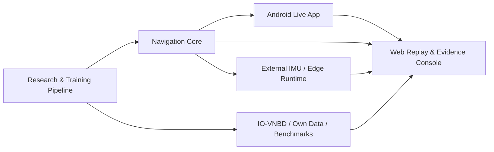
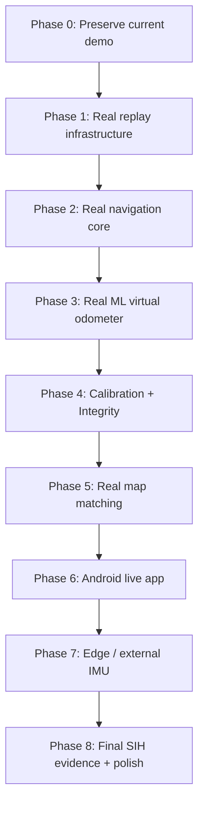
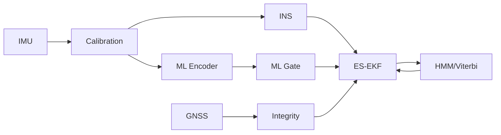
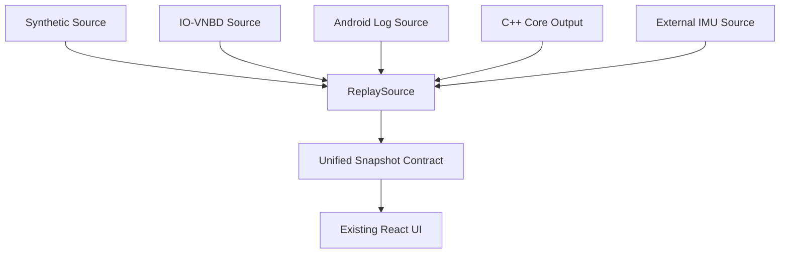

# AstraNav-IDR — Detailed Next-Steps Plan
## Prototype → Research-Grade Demonstrator → PS-Aligned Mobile Navigation System

> **Project:** AstraNav-IDR  
> **Team:** Recalibrate  
> **Problem Statement:** SIH26168 — AI-ML based Intelligent Dead Reckoning system for seamless navigation  
> **Repository reviewed:** `Stakeylock/sih26`  
> **Repository basis:** `main` @ `bced51a6e710a1a9c3bdf8df9271f5b7d7253b97`  
> **Primary objective of this document:** define the next engineering, UI/UX, validation, presentation, data, architecture and demo steps needed to turn the current deterministic browser prototype into a convincing, useful, PS-aligned navigation prototype.

---

# 0. Executive Direction

The current prototype should **not be thrown away**.

Its strongest value is that it already behaves like a **navigation observability console** rather than a simple animated mockup:

- separate INS, fused, map-assisted and classical trajectories;
- GNSS degradation / denial / reacquisition;
- fault injection;
- event ledger;
- metrics and exports;
- deterministic replay;
- explicit synthetic/validation boundary;
- expert/basic modes;
- judge-friendly visual storytelling.

The next phase should therefore follow one principle:

> **Keep the UI shell, but progressively replace synthetic internals with real data, real filtering and real model inference.**

The system should evolve into **three products sharing one architecture**:



The final prototype should tell a judge, engineer or researcher four things immediately:

1. **What the vehicle currently believes.**
2. **Why it believes it.**
3. **How uncertain it is.**
4. **Which sensors and constraints are being trusted right now.**

That should become the design language of the entire product.

---

# 1. Product Vision

## 1.1 What AstraNav-IDR should feel like

AstraNav-IDR should not feel like:

- another GPS map;
- an animated dashboard;
- a black-box AI demo;
- a static simulator.

It should feel like:

> **A mission-control interface for trustworthy navigation under GNSS degradation.**

The user should be able to see, in one glance:

- current vehicle position;
- current navigation mode;
- current confidence;
- current active constraints;
- current GNSS trust state;
- current model quality;
- current map hypothesis;
- what changed in the last few seconds;
- what the system will do next.

---

# 2. Current Prototype — What to Preserve

The current codebase already contains a good conceptual structure:

```text
Navigate
Replay Lab
Evidence
Architecture
```

Do not replace these. Improve them.

The current browser prototype has:

```text
src/App.tsx
src/components/CityMap.tsx
src/components/Telemetry.tsx
src/components/Playback.tsx
src/components/ReplayLab.tsx
src/components/Evidence.tsx
src/components/SystemView.tsx
src/engine/simulation.ts
src/engine/scenarios.ts
src/engine/types.ts
src/hooks/useReplay.ts
```

This is a clean foundation.

The current four primary UI views should evolve into:

```text
1. Navigate       → operational navigation view
2. Replay Lab     → controlled experiment / fault lab
3. Evidence       → benchmark and validation dashboard
4. Architecture   → system explainability / pipeline inspector
```

Then add two more:

```text
5. Calibration    → sensor, frame and alignment health
6. Experiments    → compare saved benchmark runs
```

Optional later:

```text
7. Data Manager   → import/manage IO-VNBD and own-phone recordings
8. Device Lab     → phone/external-IMU performance profiling
```

---

# 3. High-Level Next-Steps Roadmap



Priority principle:

```text
Real evidence first.
Then UI polish around real evidence.
Not the other way around.
```

---

# 4. Phase 0 — Stabilize the Current Prototype

Before major additions, freeze a clean baseline.

## 4.1 Add a version banner

Top-right UI:

```text
MODE: SYNTHETIC
ENGINE: Browser v0.2
MODEL: Simulated
MAP: Synthetic
DATA: Scenario / Tunnel
```

Use explicit color coding:

- **Synthetic** → violet/amber.
- **Replay** → blue.
- **Live** → green.
- **Degraded / warning** → amber.
- **Critical / denied** → red.

Do not let the user confuse the current demo with validated performance.

---

## 4.2 Add a run manifest

Every replay should have:

```yaml
run_id:
mode:
source:
scenario:
dataset:
session:
model_version:
filter_version:
map_version:
software_commit:
seed:
start_time:
blackout_duration:
faults:
```

Expose it through an **Info / Provenance** drawer.

---

## 4.3 Add run locking

Once a run starts:

```text
configuration = immutable
```

Changing:

- scenario;
- ML on/off;
- map on/off;
- blackout length;

should create a **new run**, not mutate the active one.

This keeps evidence reproducible.

---

# 5. UI/UX Master Redesign

## 5.1 Main layout

Recommended desktop layout:

```text
┌─────────────────────────────────────────────────────────────────────────┐
│ AstraNav-IDR       MODE: IO-VNBD REPLAY      HEALTH: 82       10 Hz    │
├────────┬─────────────────────────────────────────────┬──────────────────┤
│ NAV    │                                             │                  │
│ LAB    │                  MAP                        │   TRUST PANEL     │
│ DATA   │                                             │                  │
│ CAL    │                                             │                  │
│ EVID   │                                             │                  │
│ ARCH   │                                             │                  │
├────────┴─────────────────────────────────────────────┴──────────────────┤
│ Timeline  ────── GNSS DEGRADED ───── DENIED ───── REACQUIRING ─────   │
└─────────────────────────────────────────────────────────────────────────┘
```

The navigation map remains the dominant visual.

---

# 6. Navigate View — Make It the Hero Screen

The current map is already strong. It should become a **judge-ready live navigation view**.

## 6.1 Top status ribbon

At the top:

```text
NAVIGATION HEALTH     86 / 100
GNSS                  DEGRADED
INS                   ACTIVE
ML ODOMETER           READY 92%
ROAD MATCH             ASTER AVENUE 87%
POSITION BOUND         ±8.2 m
OUTPUT RATE            10.0 Hz
```

This status ribbon should animate subtly when values change.

---

## 6.2 Navigation state chip

Use one large chip:

```text
TRUSTED
DEGRADED
SUSPECT
DENIED
REACQUIRING
```

Under it:

```text
Why?
GNSS innovation increasing
Satellite geometry weak
INS + ML aiding remains consistent
```

Judges should not need to interpret raw numbers first.

---

## 6.3 Add a “Why?” button everywhere

Every major status should be explainable.

Example:

```text
GNSS: DEGRADED
[Why?]
```

On click:

```text
Horizontal accuracy: 18.2 m
Position innovation: 24.7 m
Speed residual: 1.1 m/s
Road mismatch: Moderate
Action: GNSS covariance inflated ×4
```

This makes the system feel intelligent and trustworthy.

---

# 7. Make the Map Much More Informative

## 7.1 Trajectory layers

Keep:

- Reference.
- INS.
- ES-EKF.
- Map-assisted.
- Classical comparator.
- GNSS observations.
- Uncertainty bound.

Add:

- AI-predicted velocity vector.
- heading vector.
- road-heading vector.
- GNSS residual vector.
- covariance ellipse.
- map-candidate segments.
- future route preview.
- sensor-source icons along the timeline.

---

## 7.2 Confidence ellipse instead of only radius

Current display uses a circular bound.

Upgrade to:

```text
2-D covariance ellipse
```

Show:

- major axis;
- minor axis;
- orientation.

This is much more realistic for navigation uncertainty.

Use:

\[
\Sigma_{xy}
=
\begin{bmatrix}
\sigma_x^2 & \sigma_{xy}\\
\sigma_{xy} & \sigma_y^2
\end{bmatrix}
\]

Compute 95% ellipse.

---

## 7.3 Map candidate view

When ambiguous:

```text
Aster Avenue          52%
Service Road          41%
North Ramp             7%
```

Highlight candidate road segments with opacity proportional to probability.

When confidence becomes high:

```text
Aster Avenue          91%
Service Road           6%
North Ramp             3%
```

Show:

```text
ROAD FEEDBACK: ENABLED
```

---

# 8. Trust Panel — Turn It Into a Core Product Feature

The right-side telemetry should become the **Trust Panel**.

It should have six cards:

```text
1. GNSS TRUST
2. IMU / INS HEALTH
3. ML VIRTUAL ODOMETER
4. ALIGNMENT
5. MAP MATCH
6. NAVIGATION HEALTH
```

Each card:

```text
STATUS
VALUE
TREND
WHY
CURRENT ACTION
```

Example:

```text
ML VIRTUAL ODOMETER
READY
13.8 m/s ±0.4
Confidence 91%
OOD 0.07

Action:
Used by ES-EKF
R_v = 0.16
```

---

# 9. Add an Active-Constraint Panel

This would greatly improve technical presentation.

Show:

```text
ACTIVE FILTER UPDATES

✓ NHC
✓ ML SPEED
✕ ZUPT
✕ ZARU
✓ GNSS POSITION
✓ GNSS VELOCITY
✕ ROAD HEADING
```

When GNSS disappears:

```text
✕ GNSS POSITION
✕ GNSS VELOCITY
✓ NHC
✓ ML SPEED
✕ ROAD HEADING
```

When road confidence becomes strong:

```text
✓ ROAD HEADING
```

This instantly communicates the hybrid architecture.

---

# 10. Timeline — Make It the Second Most Important Visual

The current playback timeline can become a **navigation event timeline**.

Show bands:

```text
0s                           120s
│────────────────────────────────│
  TRUSTED
        DEGRADED
             DENIED─────────────
                              REACQUIRING
                                      TRUSTED
```

Add event markers:

```text
▲ pothole
▲ mount shift
▲ GNSS jump
▲ ML OOD
▲ road ambiguity
▲ ZUPT event
▲ road match locked
```

Click marker:

```text
00:45.2 — POTHOLE
Acceleration impulse detected
ML speed suspended
NHC covariance inflated
Navigation health: 83 → 71
Recovery: 3.0 s
```

---

# 11. Add Time-Synchronized Charts

Under the map or in a bottom drawer:

```text
Speed
Heading
GNSS residual
NIS
Position bound
ML uncertainty
Alignment confidence
Navigation health
```

All charts should share the same cursor.

Dragging the cursor should seek the map.

---

# 12. Calibration View

Add a dedicated **Calibration** tab.

## 12.1 Calibration dashboard

Show:

```text
PHONE ORIENTATION
Roll       +3.1°
Pitch      -1.4°
Yaw offset +87.2°

ALIGNMENT CONFIDENCE
94%

GYRO BIAS
X +0.0021 rad/s
Y -0.0014 rad/s
Z +0.0040 rad/s

ACCEL BIAS
X ...
Y ...
Z ...

GRAVITY CONSISTENCY
9.79 m/s²

STATUS
ALIGNED
```

---

## 12.2 3-D phone-to-vehicle visualization

Use a simple 3-D model:

```text
Vehicle frame:
Forward → X
Right   → Y
Down    → Z

Phone frame:
rotated relative to vehicle
```

Animate the transform.

This would visually explain one of the most important PS requirements.

---

## 12.3 Guided calibration wizard

For Android app:

```text
Step 1
Place phone securely.

Step 2
Keep vehicle stationary for 5 seconds.

Step 3
Drive straight for 10–15 seconds.

Step 4
Alignment acquired.

Pitch  2.4°
Roll  -1.1°
Yaw   83.7°
Confidence 96%
```

---

# 13. Replay Lab — Upgrade It Into a Real Experiment Console

The current Replay Lab is good. Expand it.

## 13.1 Fault categories

Current:

- GNSS jump;
- pothole;
- mount shift;
- bad speed.

Add:

### GNSS
- constant position bias;
- intermittent dropout;
- full blackout;
- poor accuracy;
- heading jump;
- satellite count collapse.

### IMU
- gyro bias ramp;
- accelerometer bias;
- saturation;
- packet drops;
- timestamp jitter;
- axis swap;
- scale error.

### ML
- overconfident wrong speed;
- OOD road condition;
- missing inference;
- high latency;
- stale output.

### Map
- incorrect road;
- missing road;
- ambiguous parallel roads;
- flyover;
- impossible turn.

---

# 14. Fault Injection UI

Use a structured drawer:

```text
FAULT TYPE
[ GNSS Jump ▼ ]

START
00:37.0

DURATION
5.0 s

MAGNITUDE
50 m

DIRECTION
North-East

[Inject]
```

Make every fault fully reproducible.

---

# 15. Add Before/After Comparator

Powerful presentation feature:

```text
COMPARE

A: Classical filter
B: AstraNav full system

Final error
A 32.4 m
B 11.8 m

Drift
A 15.2%
B 5.6%

Heading error
A 7.9°
B 2.1°
```

Allow split-screen map:

```text
LEFT              RIGHT
Classical         AstraNav
```

or overlay.

---

# 16. Evidence View — Make It Publication-Quality

Evidence should become the **technical proof page**.

## 16.1 Summary cards

```text
DATASET
IO-VNBD

SESSION
S_...

BLACKOUT
60 s

DISTANCE
742 m

FINAL ERROR
42.1 m

DRIFT
5.67%

P95 ERROR
...

HEADING MAE
...

SPEED RMSE
...
```

---

## 16.2 Baseline table

```text
Estimator            Final Error     Drift      RMSE
Raw INS              96.2 m          12.9%      ...
ES-EKF + NHC         64.1 m           8.6%
+ ML Speed           46.8 m           6.3%
+ Uncertainty        43.1 m           5.8%
+ Map Constraint     39.5 m           5.3%
```

---

# 17. Add Ablation Controls

Users should be able to disable:

```text
[ ] NHC
[ ] ZUPT/ZARU
[ ] ML speed
[ ] ML uncertainty
[ ] GNSS integrity gate
[ ] map matcher
[ ] road feedback
```

Then rerun.

This makes the demo much more scientific.

---

# 18. Add Experiment Comparison

New page: **Experiments**.

```text
Experiment A
IO-VNBD Trip 07
Model v1.3
60s blackout

Experiment B
Same trip
Model v1.4
60s blackout
```

Comparison:

```text
                 v1.3      v1.4
Speed RMSE       1.24      0.91
Drift            7.2%      5.6%
P95 error        61 m      49 m
Inference        3.2ms     3.5ms
```

---

# 19. Add a Run Library

Saved runs:

```text
Tunnel 60s / IO-VNBD / v1.2
Urban 30s / own phone / Pixel 8
Parking / own phone / S23
Mount shift / synthetic
```

Search and filter by:

- dataset;
- device;
- model;
- blackout;
- scenario;
- date.

---

# 20. Data Manager

Create a page to import and inspect data.

## 20.1 Import types

```text
IO-VNBD
Android log
CSV
JSON
External IMU log
Synthetic run
```

---

## 20.2 Data quality report

After import:

```text
IMU samples        182,491
IMU rate           98.4 Hz
GNSS samples       1,824
GNSS rate          0.98 Hz
Dropped samples    0.4%
Timestamp gaps     17
Accel saturation   0
Gyro saturation    2
Temperature range  31–42°C
```

---

# 21. Architecture View — Make It Interactive

Current Architecture view is already useful.

Upgrade it to a **live system graph**.



As replay runs:

- green line = active;
- gray = inactive;
- amber = degraded;
- red = rejected.

Click block to see live values.

Example:

```text
ES-EKF
Update rate: 100 Hz
P trace: 42.1
Last measurement: ML speed
Last NIS: 2.7
```

---

# 22. Navigation Health Score

Current heuristic health score can become a structured indicator.

Use components:

```text
GNSS integrity         0–20
IMU health             0–15
Alignment              0–15
ML confidence          0–15
Filter consistency     0–20
Map confidence         0–10
Timing/packet health   0–5
```

Do not hide the composition.

Show:

```text
HEALTH 78 / 100

GNSS          10 / 20
IMU           15 / 15
Alignment     14 / 15
ML            13 / 15
Filter        17 / 20
Map            7 / 10
Timing         2 / 5
```

---

# 23. Basic vs Expert Mode

Current basic/expert toggle is valuable.

Refine it.

## Basic

Show only:

- vehicle;
- route;
- navigation state;
- position confidence;
- simple explanation;
- speed;
- heading;
- GNSS status.

## Expert

Show:

- all trajectory layers;
- covariance;
- NIS;
- model uncertainty;
- road candidates;
- active constraints;
- alignment;
- bias;
- residuals;
- event ledger.

This keeps the judge-facing UI clean while preserving engineering depth.

---

# 24. Judge Mode

Add a third mode:

```text
BASIC
EXPERT
JUDGE
```

Judge mode should be choreographed.

One button:

```text
PLAY 2-MINUTE DEMO
```

The system automatically:

1. starts with trusted GNSS;
2. shows degradation;
3. highlights rejected bad GNSS;
4. enters blackout;
5. shows INS drift;
6. shows AI/ES-EKF outperforming INS;
7. injects pothole;
8. shows ML suspension/recovery;
9. shows map ambiguity;
10. shows map confidence lock;
11. returns GNSS;
12. shows controlled reacquisition;
13. opens final Evidence summary.

This makes the demo deterministic and presentation-safe.

---

# 25. Add Narrative Callouts

During Judge mode:

```text
01 / 06
GNSS IS DEGRADING
The system reduces satellite trust before complete signal loss.
```

Then:

```text
02 / 06
GNSS DENIED
Dead reckoning continues using INS + learned velocity + vehicle constraints.
```

Then:

```text
03 / 06
POTHOLE DETECTED
ML aiding temporarily suspended to avoid treating vibration as true vehicle motion.
```

Narrative callouts will dramatically improve presentation.

---

# 26. Mobile UI

The Android version should not simply replicate the desktop dashboard.

## 26.1 Mobile main screen

```text
┌─────────────────────┐
│ AstraNav-IDR        │
│ NAV HEALTH 87       │
├─────────────────────┤
│                     │
│       MAP           │
│                     │
├─────────────────────┤
│ 52 km/h     086°    │
│ ±8 m                │
│ GNSS: DENIED        │
├─────────────────────┤
│ INS + ML ACTIVE     │
└─────────────────────┘
```

Swipe-up bottom sheet:

```text
GNSS
ML
Alignment
Map
Filter
Sensor details
```

---

# 27. Android Calibration Flow

Make startup professional:

```text
Checking sensors...
✓ Accelerometer
✓ Gyroscope
✓ Magnetometer
✓ GNSS

Stationary calibration
██████████ 100%

Drive straight when safe
██████░░░░ 63%

Alignment acquired
Confidence 94%
```

---

# 28. Real-Time Sensor Diagnostics

Add a hidden/advanced page:

```text
Accelerometer    99.8 Hz
Gyroscope        99.7 Hz
GNSS              1.0 Hz
Model inference  20.0 Hz
Navigation       10.0 Hz

Dropped packets  0.2%
Sensor lag       4.1 ms
Model latency    2.8 ms
Filter latency   0.4 ms
```

This gives credibility during technical judging.

---

# 29. IO-VNBD Integration — Highest Priority

Before more UI polish, implement this.

## 29.1 New mode

```text
MODE: IO-VNBD REPLAY
```

Load a real trip.

Map and charts should render from real measurements.

---

## 29.2 Mandatory evidence view

For each selected blackout:

```text
Blackout start
Blackout end
Distance travelled
Reference trajectory
Raw INS
Classical filter
AI-aided filter
Final error
Drift %
```

---

# 30. Replay Adapter Architecture

Refactor current engine:



Create:

```ts
interface ReplaySource {
  id: string;
  metadata: RunMetadata;
  duration: number;
  getSnapshot(t: number): Snapshot;
  getEvents(t: number): NavigationEvent[];
}
```

---

# 31. Real Navigation Core

Current reduced-order TypeScript estimator should eventually become a C++ core.

Use:

```text
Core/
  Frames
  Calibration
  Mechanization
  ES-EKF
  Constraints
  GNSS Integrity
  ML Measurement Adapter
  Map Matcher
  Health
  Replay
```

The web UI remains a visualization client.

---

# 32. Real AI Model

Replace simulated:

```text
truth speed + noise
```

with:

```text
IMU window
→ model
→ speed
→ uncertainty
→ context
→ OOD
```

The UI should display model provenance:

```text
Model
virtual_odo_tcn_v03.onnx

Input
2.0 s × 100 Hz × 6-axis

Inference
2.8 ms

Speed
13.8 ± 0.4 m/s

OOD
0.07
```

---

# 33. Real Self-Calibration

Add actual states:

```text
UNCALIBRATED
STATIONARY_INIT
LEVELING
YAW_ALIGNING
ALIGNED
SUSPECT
RECALIBRATING
DEGRADED
```

Display it in UI.

---

# 34. Real GNSS Integrity

Add metrics:

```text
Horizontal accuracy
Vertical accuracy
Satellites
CN0
GNSS speed residual
Position NIS
Heading/course residual
Map consistency
```

Show decision:

```text
GNSS rejected
Reason:
NIS = 19.2 > threshold 11.3
```

This is much stronger than just saying “bad GPS”.

---

# 35. HMM/Viterbi Map Matching

Replace current current-frame candidate scorer.

UI should show:

```text
Road hypotheses over time
```

Example:

```text
Aster Avenue
0.61 → 0.72 → 0.88 → 0.94

Service Road
0.32 → 0.23 → 0.09 → 0.04
```

This visually demonstrates Viterbi-style temporal consistency.

---

# 36. Road Feedback Safety

When road match is used:

```text
ROAD HEADING AID
ENABLED

Road heading: 084.2°
Estimated:    087.9°
Residual:      -3.7°
Applied correction: -0.9°
```

When ambiguous:

```text
ROAD HEADING AID
PAUSED

Reason:
Top posterior margin too small
```

---

# 37. Advanced Visualizations

Useful expert visuals:

### Covariance waterfall
Show position/heading uncertainty increasing during blackout.

### Bias plots
\[
b_a(t), b_g(t)
\]

### Innovation plots
GNSS and learned measurement residuals.

### NIS plot
Show thresholds.

### Road hypothesis heatmap
Candidate probability vs time.

### Alignment plot
roll/pitch/yaw alignment confidence.

### Health timeline
Overall navigation health over time.

---

# 38. Event Ledger Improvements

Current event ledger should evolve into a searchable structured log.

Columns:

```text
Time
Subsystem
Severity
Event
Reason
Action
Recovery
```

Example:

```text
45.2
ML
WARN
Pothole impulse
High-frequency vibration
Suspend ML for 3 s
Recovered 48.2
```

Filters:

```text
GNSS
IMU
ML
Filter
Map
Alignment
Runtime
```

---

# 39. Explainability Panel

Add:

```text
WHY IS THE VEHICLE HERE?
```

Break down latest contributions:

```text
INS propagation           dominant
ML speed correction       +0.8 m/s
NHC                       lateral velocity constrained
GNSS                      unavailable
Road heading              +1.4° correction
ZUPT                      inactive
```

This can become one of the most compelling features.

---

# 40. Evidence Provenance

Every metric should be clickable.

Example:

```text
Drift 5.8%
```

Click:

```text
Formula:
100 × final_position_error / blackout_distance

Final position error:
43.1 m

Blackout distance:
742.8 m

Source:
IO-VNBD / Trip ...
Model:
virtual_odo_v03
Filter:
eskf_v02
Commit:
...
```

This is excellent for technical credibility.

---

# 41. Export Package

One-click:

```text
EXPORT EXPERIMENT
```

Creates:

```text
manifest.json
trajectory.csv
events.csv
metrics.json
plot_trajectory.png
plot_errors.png
plot_uncertainty.png
model_info.json
filter_config.json
README.md
```

---

# 42. Report Generator

Optional high-value feature:

```text
Generate Experiment Report
```

Auto-produce Markdown/PDF later containing:

- run metadata;
- dataset;
- configuration;
- plots;
- metrics;
- failures;
- conclusion.

For SIH, even Markdown export is sufficient initially.

---

# 43. Real-World Own-Phone Data Collection

Build an Android logger early.

Capture:

```text
timestamp
accelerometer
gyroscope
magnetometer
GNSS lat/lon/alt
GNSS speed
accuracy
satellites
temperature if available
orientation metadata
```

Collect:

- straight roads;
- curves;
- stop-go;
- speed bumps;
- potholes;
- parking;
- tunnel;
- intentional mount rotations.

---

# 44. Dataset Dashboard

For own data:

```text
Device
Samsung S23

Drive
2026-09-XX / Hyderabad

Duration
32 min

Distance
18.4 km

IMU
99.6 Hz

GNSS
1.0 Hz

Road types
Urban / Flyover / Rough / Parking
```

---

# 45. Performance Profiling Page

For Android:

```text
CPU usage
RAM
Model latency
Filter latency
UI latency
Battery drain
Temperature
Dropped samples
```

Use charts over time.

---

# 46. External IMU Mode

Later add:

```text
SOURCE
PHONE IMU
EXTERNAL IMU
```

Same navigation core.

External mode UI:

```text
Input rate: 200 Hz
Sensor profile: FOG / Tactical / MEMS
Packet loss: 0.0%
Temperature: ...
```

Do not claim validated high-rate performance until measured.

---

# 47. Design System

The visual language should remain dark and technical.

Recommended semantic color system:

```text
GNSS Trusted        Green
GNSS Degraded       Amber
GNSS Suspect        Orange
GNSS Denied         Red
Reacquiring         Cyan
INS                  Amber
ES-EKF               Cyan
Map-assisted         Lime
Classical comparator Coral
Reference            White/gray
Uncertainty          Violet
ML                    Blue-violet
```

Use colors consistently everywhere.

---

# 48. Typography

Use:

```text
Large status → bold sans
Technical numbers → tabular/monospace
Body → clean sans
Equations/IDs → monospace
```

Critical numeric values should align.

Example:

```text
Speed          13.82 m/s
Heading        084.2 °
Pos Bound       8.21 m
NIS             3.48
```

---

# 49. Avoid Visual Overload

Expert mode can be dense, but default view should be readable.

Rule:

```text
Primary signal → large
Secondary signal → medium
Engineering detail → expandable
```

Do not show 20 charts at once.

Use drawers/tabs.

---

# 50. Accessibility

Useful even for judges:

- do not rely on color only;
- include icons/text labels;
- keyboard navigation;
- large click targets;
- high contrast;
- status text like `DENIED`, not just red;
- charts with visible legends.

---

# 51. Demo Reliability

Create a **demo lock mode**:

```text
DEMO LOCKED
No random state
No network dependency
No map API dependency
No external server
Known dataset
Known model
Known run
```

All assets should be local.

---

# 52. Offline-First Packaging

For competition:

- bundle OSM region locally;
- bundle ONNX model;
- bundle 2–3 known IO-VNBD runs;
- bundle synthetic fallback;
- bundle docs/help;
- no authentication dependency;
- no internet dependency.

---

# 53. “What Happens If Everything Fails?” Screen

Add a graceful fallback:

```text
NAVIGATION DEGRADED

GNSS unavailable
ML suspended
Road match ambiguous

INS-only propagation active

Position uncertainty:
±42 m and growing
```

This is better than pretending everything is fine.

---

# 54. Confidence Philosophy

Never hide uncertainty.

UI should always expose:

```text
Estimate
Confidence
Source
Reason
```

Example:

```text
Speed
51.2 km/h

Source
ML virtual odometer

Confidence
87%

Used by filter
Yes
```

---

# 55. Prototype Feature Backlog

## P0 — Must build next

```text
IO-VNBD loader
Unified replay-source interface
Real benchmark replay in UI
15-state ES-EKF skeleton
NHC
Real trained virtual odometer
Required IO-VNBD position plot
Run provenance
Synthetic / Replay / Live badge
```

## P1 — Strong prototype

```text
Alignment/calibration view
Android sensor logger
ONNX on-device inference
GNSS integrity metrics
ZUPT/ZARU
OSM offline graph
HMM/Viterbi
experiment comparison
active constraint panel
NIS plots
```

## P2 — High polish

```text
Judge mode
Narrative callouts
3-D alignment viewer
health decomposition
run library
report export
advanced fault injection
model inspector
covariance ellipse
device-performance lab
```

## P3 — Advanced research

```text
shadow estimator
IMM / motion modes
thermal bias compensation
cross-device adaptation
3-D learned velocity
factor graph smoother
Monte Carlo fault campaigns
integrity risk bounds
```

---

# 56. Recommended Engineering Order

Do not implement randomly.

## Sprint 1 — Data realism

```text
1. ReplaySource interface
2. IO-VNBD parser
3. real trip replay
4. evidence provenance
5. benchmark blackout selector
```

## Sprint 2 — Physics core

```text
1. coordinate frames
2. quaternion mechanization
3. 15-state ES-EKF
4. GNSS update
5. NHC
6. unit tests
```

## Sprint 3 — ML

```text
1. trip-disjoint split
2. 1-D CNN/TCN baseline
3. uncertainty head
4. ONNX export
5. replay integration
```

## Sprint 4 — Alignment + integrity

```text
1. startup bias
2. gravity leveling
3. yaw alignment
4. mount detection
5. GNSS state machine
6. NIS
```

## Sprint 5 — Mapping

```text
1. OSM graph loader
2. candidates
3. HMM/Viterbi
4. road-heading feedback
5. ambiguity visualization
```

## Sprint 6 — Android

```text
1. sensor logger
2. GNSS logger
3. native core bridge
4. ONNX
5. live map
6. 10 Hz output benchmark
```

## Sprint 7 — Presentation polish

```text
1. Judge mode
2. narrative demo
3. comparison page
4. experiment report
5. final test suite
```

---

# 57. Suggested Repository Evolution

```text
sih26/
├── web/
│   └── current React prototype
├── android/
│   └── Kotlin application
├── core/
│   ├── include/
│   ├── src/
│   └── tests/
├── ml/
│   ├── datasets/
│   ├── training/
│   ├── evaluation/
│   └── export/
├── adapters/
│   ├── io_vnbd/
│   ├── synthetic/
│   ├── android/
│   └── external_imu/
├── experiments/
├── maps/
├── models/
├── configs/
└── docs/
```

---

# 58. Acceptance Gates by Phase

## Data gate

Pass if:

```text
IO-VNBD trip renders end-to-end.
No estimator uses hidden reference.
Blackout can be configured.
Metrics reproduce.
```

## Filter gate

Pass if:

```text
15-state filter stable.
NHC works.
GNSS rejection works.
Covariance finite.
```

## ML gate

Pass if:

```text
Held-out speed improves over simple baseline.
Uncertainty correlates with error.
No leakage.
ONNX parity confirmed.
```

## Map gate

Pass if:

```text
HMM handles parallel roads/flyovers better than nearest-road.
Bad match does not corrupt state.
```

## Mobile gate

Pass if:

```text
Live sensors work.
No UI blocking.
Navigation output ~10 Hz.
Logging complete.
```

---

# 59. Judge-Facing Story

The final demo should tell one clean story:

```text
1. Phone starts with GNSS.
2. System self-calibrates.
3. GNSS becomes unreliable.
4. Integrity manager reduces GNSS trust.
5. GNSS disappears.
6. INS continues.
7. ML speed and NHC constrain drift.
8. Pothole occurs.
9. AI confidence drops and aiding is suspended.
10. Road hypotheses stay probabilistic.
11. One road becomes confident.
12. Heading constraint safely assists.
13. GNSS returns.
14. First fixes are not blindly trusted.
15. Reacquisition confirms consistency.
16. System restores GNSS.
17. Evidence page shows drift, error and provenance.
```

---

# 60. Final Presentation Objective

The audience should leave with this understanding:

> **AstraNav-IDR is not “AI predicting where the car is.” It is an integrity-aware navigation architecture in which inexpensive phone sensors are calibrated, physics propagates vehicle motion, AI reconstructs useful virtual measurements, uncertainty governs trust, road topology constrains drift, and every decision can be inspected and validated.**

And the UI should make that visible without requiring the judge to understand Kalman-filter mathematics first.

---

# 61. Immediate Next 10 Tasks

Do these in this exact order:

1. **Refactor the web app to support multiple `ReplaySource` types.**
2. **Implement IO-VNBD import and render one real trip in the current UI.**
3. **Add strong mode/provenance labels: SYNTHETIC / IO-VNBD / LIVE.**
4. **Create the required IO-VNBD blackout trajectory/evidence view.**
5. **Implement a real 15-state ES-EKF skeleton in a separate core module.**
6. **Add NHC as an explicit measurement update.**
7. **Train a simple real virtual-speed baseline and wire ONNX inference.**
8. **Add an Active Constraints + Trust panel to the UI.**
9. **Add calibration/alignment state and visual diagnostics.**
10. **Build Judge Mode using the real replay path, not synthetic values.**

That sequence gives you the largest increase in both **technical legitimacy** and **presentation quality** with the least wasted work.
